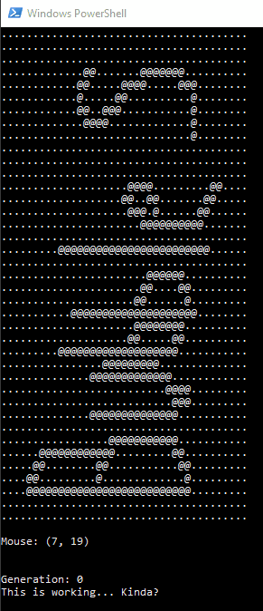

# Automata: A Conway's Game of Life Variant

This is Automata, a Golang implementation of Conway's Game of Life with a twist! This program simulates the evolution of cellular automata, where the next state of a cell depends on its current state and the states of its neighbors.

## Features:

* Classic Conway's Game of Life rules.
* Visual representation of the cellular automata grid.

## Instructions:

1. **Prerequisites**: Ensure you have Golang installed and configured on your system. You can find installation instructions on the official [Golang website](https://go.dev/).

2. Clone the Repository:

```shell
git clone https://github.com/KalebHawkins/automata
```

3. Build the Program:

Navigate to the project directory and run:

```shell
go build
```

This will create an executable file named automata.

4. Run the Program:

Execute the program:

```shell
./automata
```


This will start the simulation.

## Screenshots:



<!-- ## Further Customization (Optional):

Briefly describe any features that allow customization of the simulation (e.g., grid size, initial state, custom rules). -->

## Contributing 

If you'd like to contribute to this project, feel free to submit pull requests!

## TODO

- [ ] BugFix: Cell values get all jumbled when call SetHeight... bug or feature...? IDK.
- [ ] Enhancement: Glamourize (chrambracelet reference...). Add some lipgloss.
- [ ] Enhancement: Handle grids with different width and height. Right now I force the grid equal width height.
- [ ] Enhancement: Add help section to display usage.
- [ ] Enhancement: Allow setting the FPS to allow for slower animation speed.
- [ ] Open Issues: for all of the above things.